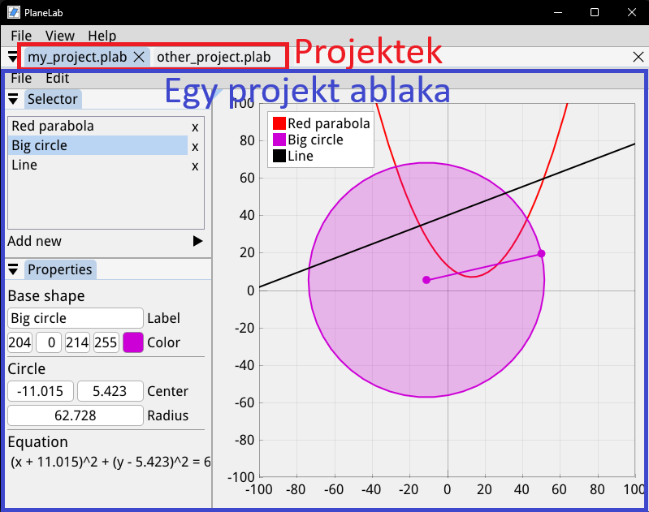
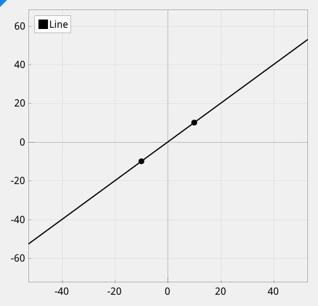
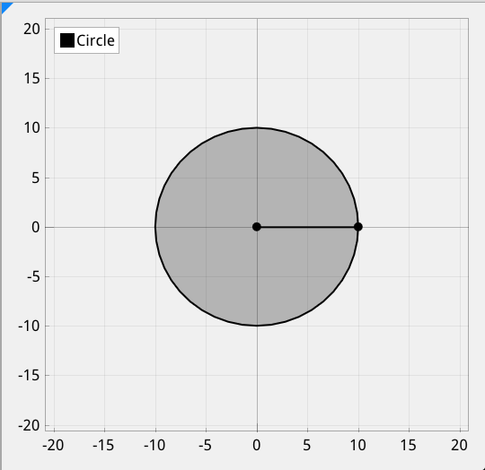
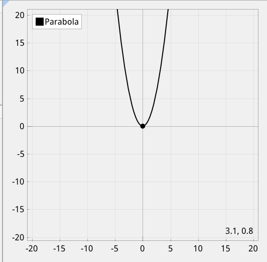
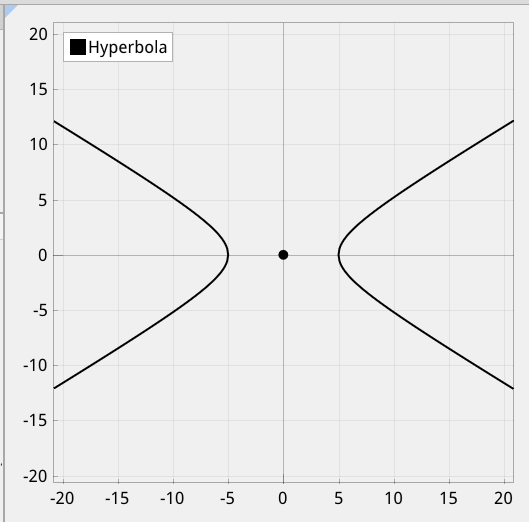

# A program lényege
A PlaneLab egy matematikai alakzatok szerkesztésére használható program, amely képes ábrákat létrehozni, azokat fájlba menteni, valamint fájlból betölteni.
# A program felépítése
A program projektnek nevezett egységekre épül. Egy projektben alakzatokat vehetünk fel és szerkeszthetünk, amelyeket a program kirajzol a projekthez rendelt grafikonra. A projekteket fájlba menthetjük, ahonnan később vissza is tölthetjük őket. A program használata során több projektet kezelhetünk egyszerre, ezek a fő ablakban külön füleken jelennek meg, megcímkézve a fájlnévvel.
A projektek ablakai, illetve az azokban található ablakok kattintással és húzással szabadon rendezhetőek. Egy ablak dokkolásához húzzuk a kijelölt helyek közül az egyikbe, majd engedjük el.

## Fő ablak
A fő ablak tartalmazza a jelenleg nyitva lévő projektek ablakait külön füleken, valamint a program globális menüsávját.
A menüsávban elérhető opciók:
- File 
	- New: üres projekt létrehozása új ablakba
	- Open: elmentett projektfájl kiválasztása és betöltése új ablakba
	- Exit: kilépés a programból (figyelem: a nem mentett módosítások kilépéskor elvesznek)
- View
	- Reset window layout: visszaállítja az ablakok elrendezését alapállásba
- Help
	- About: megnyitja a névjegyet tartalmazó ablakot
## Projekt ablak
Itt adhatunk új alakzatokat egy projekthez, szerkeszthetjük őket, illetve láthatjuk őket kirajzolva.
Az ablak tartalmaz egy újabb menüsávot, amelyben a projekttel kapcsolatos lehetőségek vannak:
- File
	- Save: mentés azonnal a megnyitott fájlba, vagy annak hiányában új fájlba
	- Save as: mentés új fájlba
	- Close: projekt ablak bezárása (figyelem: a nem mentett módosítások a projekt bezárásakor elvesznek)
- Edit
	- Deselect: a jelenleg kijelölt alakzat kijelölésének megszüntetése
	- Delete selected: a jelenleg kijelölt alakzat eltávolítása

Ezen kívül több egy projekt ablaka még több ablakra oszlik:
### Graph (grafikon)
A grafikonon a projekt felvett alakzatait láthatjuk kirajzolva. A grafikonon szabadon mozgathatjuk a nézetet a bal egérgomb nyomva tartásával, illetve állíthatjuk a közelítést a görgővel.
Jobb egérgombbal kattintva több opciót jeleníthetünk meg, amelyek a grafikon megjelenítésével kapcsolatosak.
A bal felső sarokban található jelmagyarázaton kattintva elrejthetjuk a kívánt alakzatokat.

### Selector (kiválasztó ablak)
Ebben az ablakban jelennek meg a jelenleg felvett alakzatok lista nézetben. A kívánt alakzat nevére kattintva kijelöljük azt, a mellette található piros x-re kattintva pedig eltávolíthatjuk (alternatívan erre használhatjuk a menüsáv "Delete selected" opcióját kijelölés után).
A kijelölés a következőket éri el:
- az alakzat tulajdonságai megjelennek a tulajdonságok ablakban, ahol változtathatunk rajtuk
- megjelennek az alakzathoz tartozó eszközök a grafikonon, amelyek mozgatásával szintén változtathatunk az alakzat tulajdonságain (ezek általában kis mozgatható pontok)
- ha az egeret az alakzatra visszük, lebegő címkeként megjelenik az alakzaton rajta lévő pont koordinátapárosa
Ezek kívül itt tudunk felvenni új alakzatokat: vigyük az egeret az "Add new" feliratra, majd válasszunk a megjelenő listáról alakzattípust. Ekkor a projekthez hozzá lesz adva a kiválasztott típusú alakzatból egy alapértelmezett konfigurációjú, amelynek a tulajdonságait később az előbb említett módon szerkeszthetjük.

### Properties (tulajdonságok ablak)
Ebben az ablakban jelennek meg a jelenleg kiválasztott alakzat tulajdonságai, amelyeket szerkeszthetünk. Ezek alakzattípusonként különbözőek, a nevet és a színt kivéve.
Az alakzatok a megadott néven és színnel fognak megjelenni a kiválasztó ablakban és a grafikon jelmagyarázatában.
Az egyes beviteli mezőkbe dupla kattintással tudunk új értéket megadni. A szám típusú beviteli mezők értékét állíthatjuk a bal egérgomb lenyomva tartásával és húzással is. A színválasztót az RGBA értékek melletti teli négyzetre kattintva jeleníthetjük meg. Érvénytelen érték megadása esetén a program megpróbálja kijavítani a mező értékét a legutóbbi helyes értékre.
Az ablak legalján található az alakzat matematikai egyenletének/függvényének behelyettesítése.
## Ábrázolható alakzatok
### Egyenes (Line)

Szerkeszthető tulajdonságok:
- alapvető alakzati tulajdonságok 
	- Label: név
	- Color: szín
- az egyenest meghatározó két pont 
	- Point 1: első pont
	- Point 2: második pont
### Kör (Circle)

Szerkeszthető tulajdonságok:
- alapvető alakzati tulajdonságok
	- Label: név
	- Color: szín
- Center: középpont
- Radius: sugár
### Parabola (Parabola)

Szerkeszthető tulajdonságok:
- alapvető alakzati tulajdonságok
	- Label: név
	- Color: szín
- Vertex: tengelypont
- Scalar: nyújtás
### Hiperbola (Hyperbola)

Szerkeszthető tulajdonságok:
- alapvető alakzati tulajdonságok
	- Label: név
	- Color: szín
- Center: középpont
- Stretch: vízszintes és függőleges nyújtás